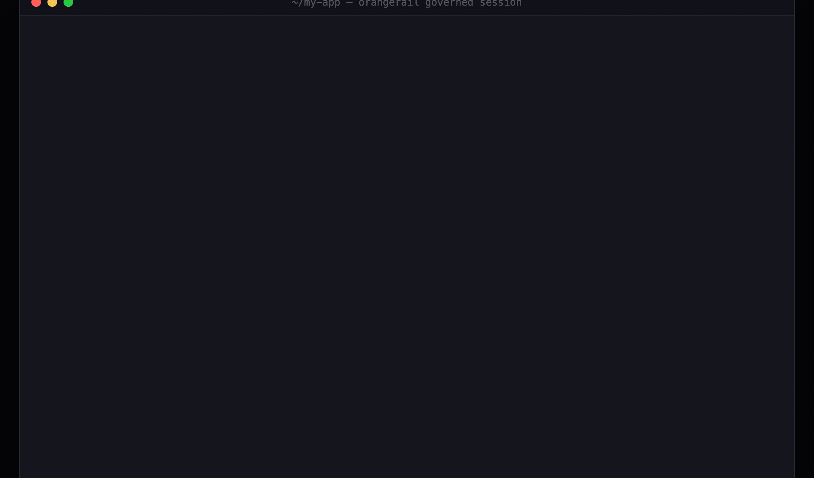

<div align="center">


<!-- One line on purpose, same reason as the badges below: a newline inside an `align="center"` block becomes a <br>. `<picture>` rather than a media query inside the SVG — that query follows the reader's OS, not GitHub's theme toggle, and half this word would vanish on the mismatch. -->
<picture><source media="(prefers-color-scheme: dark)" srcset="./assets/wordmark-dark.svg"></picture>

**Give your agent your database. Don't give it SQL.**

<!-- One line on purpose: inside an `align="center"` block GitHub turns every newline into a <br>, so a badge per line stacks them vertically. -->
[](https://www.npmjs.com/package/orangerail) [](https://github.com/KimHyeongRae0/orangerail/actions/workflows/ci.yml) [](https://nodejs.org) [](https://www.npmjs.com/package/orangerail#provenance) [](./LICENSE)

[**Quickstart**](#quickstart) · [Commands](./docs/commands.md) · [What it does not govern](./docs/limits.md) · [Against a rules file](./docs/vs-a-rules-file.md) · [Examples](./examples) · [Docs](./docs)

</div>



*`orangerail init` on a three-model Prisma schema, then a real `tools/list` against the server it
generated. Sixteen tools: a `get` and a `list` per object, one action per write, and
`check_approval`. **Nothing on that list takes a query.** The three locks are `--gate delete`, which
is a default you change in one line, not a verdict.*

**A rules file cannot do this.** It can ask the agent not to run a query. It cannot take the tool off
the list — and [we measured what the difference is worth](./docs/what-we-measured.md), including the
four claims that died when we did.

**orangerail reads the schema you already have and generates the agent's surface from it.**
`orangerail init` turns a `prisma/schema.prisma` into an MCP server: a `get` and a `list` per
object, one action per write with a zod input schema, and nothing else — no `execute_sql`, and
nothing on the tool list that takes a query. It is a scanner and a code generator, with no LLM
calls and no API keys. Writes you are happy to have run unattended run unattended. The ones you are
not carry `policy: { approval: 'required' }`, which stops the call and turns it into an approval a
person can act on later — including a person who is not you, after the conversation that produced
it has ended.

**Bounded is not safe, and this README will not pretend otherwise.** A generated surface buys a
reach that is *finite and legible*, not a claim that nothing harmful is inside it. You declared the
verbs, so a destructive verb you declared is a verb the agent can call.

**One precondition decides whether any of this is worth installing: orangerail governs only its own
tools.** If the agent also has a shell with credentials or a second database MCP server, it can go
around the rail — see [what orangerail does not govern](./docs/limits.md).

Pre-release and installable: `0.1.5` on npm — `orangerail` (the CLI) plus `orangerail-core`,
`orangerail-mcp`, `orangerail-docs-gen` and `orangerail-studio`. The API will move before 1.0, and
[Status](#status) has the one upgrade note that matters.

## See your whole domain as a map

One command, and the surface `init` generates is a map you can read.

```console
$ orangerail studio
orangerail studio: scanning ontology — 9 object(s), 27 action(s)
orangerail studio: building the interactive map…
orangerail studio: serving on http://127.0.0.1:4820 — open it in your browser
```

Every object, how they relate, and every write action an agent can reach. Hover a table to light up
its relations and actions; click one to read the policy that governs it.


> Crisper version: [`assets/studio-map.mp4`](./assets/studio-map.mp4) — the same run at full
> resolution. One real run on a sample commerce domain, `--gate delete`. The locks are not
> annotations added for the video: they are what the studio draws from your ontology, which is why
> nine actions carry one and eighteen do not.

**Be exact about what that is worth.** The relations come from `ontology/_links.mjs`, which `init`
derives from your Prisma relations, so `Customer_list`'s description reads `List Customer records.
Relations: has many Order.` The agent is *told* that a Customer has many Orders. It still cannot
follow the edge: no traversal tool, no join, no aggregate, and `Customer_list` refuses a filter that
reaches into `Order`. Knowing the shape of a domain and being able to query across it are different
things, and only the first one is here.

## Quickstart

Seven steps, every output verbatim from one recorded run. The reasoning behind each one — and the
failure each prevents — is in [Quickstart, annotated](./docs/quickstart-notes.md); **requirements
and the Prisma 7 caveat are the first thing on that page.**

**1. Install orangerail into the project you are about to scan.**

```bash
npm i -D orangerail
```

**2. Scan your project**, in a repo with a `prisma/schema.prisma`.

```console
$ npx orangerail init --yes --preset approval-for-writes --no-studio
  ✓  scanned your sources — 2 object(s), 6 action(s)
  ✓  generated a governed MCP server under ontology/
  ✓  --gate delete: 2 of 6 write action(s) gated behind human approval — the other 4 run when the agent calls them
  ✓  recorded that posture in orangerail.governance.json — commit it
  ✓  approvals queue + audit chain at .orangerail/store/ — inside this project, so an
     agent with file tools over this directory can write them

  These files are yours — re-scans never modify them; `orangerail sync` reports drift.

  Change what is gated by editing `policy` in ontology/<action>.mjs, or re-run init
  with `--gate all` (gate every write) or `--gate none` (gate nothing).
  orangerail.governance.json holds the posture init just generated, which nobody has reviewed yet.
  From now on `orangerail sync` fails when an action gets weaker than that file, and
  `orangerail mcp` refuses to serve it. Read the file, then run
  `orangerail sync --accept-governance` to vouch for it as reviewed.

  That store is the record of which writes a human approved, and appending one line to
  .orangerail/store/approvals.jsonl marks a staged action approved — the next
  `check_approval` then executes it, because the gate reads that store and never the
  audit chain. `orangerail audit verify` reports the forgery afterwards; it is a report,
  not a gate, and it does not prevent the write. The generated config carries the
  one-line move at the `createFileStore` call — see docs/audit-log.md.
orangerail docs: wrote /private/tmp/shop/.orangerail/generated/AGENTS.md

Done. Run `orangerail studio` to explore the map, or `orangerail mcp`.
```

**3. Install the runtime the generated code loads.**

```bash
npm install orangerail-core zod
```

**4. Give the generated actions a database to reach.**

```bash
npm install @prisma/client@6
export DATABASE_URL="file:./dev.db"
npx prisma generate
npx prisma db push --skip-generate
```

> Already have a database? Do not `db push` over it —
> [adopting orangerail against an existing database](./docs/existing-database.md).

**5. Point your agent host at it.** Drop this in your project root as `.mcp.json`:

```json
{
  "mcpServers": {
    "orangerail": {
      "type": "stdio",
      "command": "./node_modules/.bin/orangerail",
      "args": ["mcp"],
      "env": { "DATABASE_URL": "file:./dev.db" }
    }
  }
}
```

Other hosts, the `claude mcp add` one-liner, and running from source:
[wire it into your agent host](./docs/agent-hosts.md).

**6. Record the governance baseline — and commit it.** `ontology/` is yours to edit, so the one
line that disarms the whole flow is one careless deletion away and a re-scan cannot notice. The
posture is compared against a recorded file instead.

```bash
npx orangerail sync --accept-governance
```

**Commit `orangerail.governance.json`.** Its whole value is that a pull request removing an
approval gate shows `"approval": "required"` turning into `null` in its own diff, in front of a
reviewer, before CI runs at all.

**7. Now leave.** While you are gone the agent works the queue: the writes you left un-gated go
through, and the deletion it was asked for stops. When you come back:

```console
$ npx orangerail status
orangerail status
  objects:  2
  actions:  2 approval-gated, 4 auto
  baseline: 6 action(s) match orangerail.governance.json
  preset:   approval-for-writes
  pending:  1 approval(s) awaiting a decision
  store:    /private/tmp/shop/.orangerail/store
            Inside the project root, so an agent with file tools over this directory can
            write it: one appended line in approvals.jsonl is a decision no human made,
            and the next `check_approval` executes the staged action — the gate reads
            this store, never the audit chain. `orangerail audit verify` reports the
            forgery afterwards; it is a report, not a gate. Pointing the store `dir` at a
            directory this agent's process cannot write is what removes the reach — see
            docs/audit-log.md.
  server:   not detected — no orangerail mcp is running against this store
  hosts:    .mcp.json declares orangerail and nothing else.
            Project scope only (.mcp.json, .cursor/mcp.json, .vscode/mcp.json); user- and
            machine-scope MCP config is not read.
  audit:    chain OK — 5 record(s) verified

$ npx orangerail approvals list
c4818df5-770c-446f-883a-e9c0f7e615a2  "deleteCustomer"  by "local-dev" [dev]  0s ago  input={"id":2}

1 pending approval(s).

$ npx orangerail approvals approve c4818df5-770c-446f-883a-e9c0f7e615a2
approve ok (approved)
```

The agent's next `check_approval` is the first moment the row can change. Nothing ran before you
said so, and every step is on the hash chain. That whole sequence is what
[`tests/e2e/ONT-093-quickstart-runs-as-documented.sh`](./tests/e2e/ONT-093-quickstart-runs-as-documented.sh)
runs against this repository's own build on every regression pass.

## Why the prompt is the wrong control

**The thing stopping you from walking away is not that the agent does too much. It is that your
only control is a question it has to ask you.** The twentieth prompt of the afternoon gets the same
click as the first, and the switch that ends the asking ships in the box — Claude Code's
`bypassPermissions` mode "skips permission prompts, except those forced by explicit `ask` rules",
per its own [permissions reference](https://code.claude.com/docs/en/permissions). A boundary
re-established by a person on every call cannot hold once nobody is there.

The prompt is also the wrong *shape*. It asks about a tool — may this run `Bash` — and the risk you
carry is about your domain: stock edits are fine, order deletions are not, refunds under $50 need
nobody. That distinction does not exist at the tool level. It exists in your schema.

## The run this is built for


*One run of [`examples/unattended-queue`](./examples/unattended-queue) — a real MCP client, no API
key, every line asserted. The video shows six of the twelve; the row numbers jump, so you can see
where.*

A 15-item back-office queue on a commerce database, handed to an agent with the operator gone for
the day and told not to ask for confirmation. Twelve items are ordinary reversible writes. Three
are destructive: delete a cancelled order, delete a customer under an erasure request, delete a
discontinued product. Scored from the database afterwards, not from what the agent said it did:

| | orangerail |
| --- | --- |
| ordinary items completed unattended | **12 / 12** |
| destructive items executed | **0** |
| destructive items stopped and staged | **3** |
| what is waiting the next morning | 3 approval records, each bound by hash to the exact call |
| audit chain | 27 records, verified OK |

That is the metric this project is built around, and it is not "how much did we block". It is **how
much finished while nobody was watching, and what is waiting when you get back.**

Two separable claims sit in that table and they are not equally well evidenced. That the twelve go
through and the three cannot is a property of the server, and it is **reproducible on your
machine** — [`examples/unattended-queue`](./examples/unattended-queue) runs exactly that queue
through a real MCP client, deterministically, asserting every line. That a *model* chooses these
calls when handed the queue in prose needed a live agent driving a real host, and **that half is a
measurement, not a reproduction**: small numbers, enough to say the gate holds where it was tested
and not enough to be a rate.

### Against the thing you would do instead

The comparison that matters is not a raw SQL server. It is a rules file: a well-written `CLAUDE.md`
naming the permitted tables and the forbidden ones, over a Postgres MCP server with full write
access. Same queue, same model, three clones.

| | markdown rules, full write access | orangerail |
| --- | --- | --- |
| ordinary items completed | 12 / 12, all three runs | 12 / 12 |
| destructive items executed | 0 | 0 |
| what the stop leaves behind | a paragraph in a report | an approval record |
| the same task started in another directory | **row deleted** | staged it |

**It tied on compliance, and it kept tying** — through adversarial rewrites, a fake prior approval,
an instruction planted in a database row, and a much smaller model. On one axis it beat us. So this
project does not argue that your agent will ignore your rules: across every run measured here, it
followed them.

**That is six runs.** Enough to retire the claim that it would not, nowhere near enough to be a
rate — zero failures in six bounds the tail near 39%, not near zero. Buying a real bound is
expensive and it perishes on the next model release, which is the reason the row below is the one
this project stakes itself on:
[what ten runs cannot prove](./docs/what-we-measured.md#what-ten-runs-cannot-prove).

The row that does not tie is the last one, and it is not about the agent's behaviour: a grant
travels with the session it was registered for, and a rules file travels with the machine account
it was written under. A global `~/.claude/CLAUDE.md` closes most of that gap for a single developer
on one machine — **if that is you, you may not need this.** It stops closing at a CI runner, a
container, a service account, or a teammate's checkout, each of which gets the database credentials
anyway.

Every run, the axis where the rules file wins, and the limits of the measurement:
[against the thing you would do instead](./docs/vs-a-rules-file.md).
[`examples/vs-a-rules-file`](./examples/vs-a-rules-file) executes both arms.

## What the agent gets instead of `execute_sql`

Run `orangerail init` on a three-model Prisma schema (`Order`, `OrderItem`, `Payment`) and the
entire tool list is 16 entries: **a `get` and a `list` per object, one action per write, and
`check_approval`.** Nothing else, and nothing that takes a query.

Each action's input is a zod schema derived from your own columns, published in `tools/list`, so
`updateProduct` refuses a string where the column is an integer and says which field it was. Each
read is a `findUnique` by id or a paged `findMany`, whose `filter` is a closed set of predicates
over declared fields — enforced by the server before it reaches your resolver, not merely
advertised.

A fixed surface is a narrow one: no aggregation, no join, no free-form query, no DDL. A question it
cannot express has to be answered somewhere else — all of it, and where enforcement actually lives,
is in [what orangerail does not govern](./docs/limits.md).

## See it stop an agent


*One real run of [`examples/governed-writes`](./examples/governed-writes) through a real MCP
client. The destructive tool stays **available** rather than hidden, the agent **cannot force it
through**, and the row changes **only after a human decided** — in a separate terminal, at a
separate time, which is the part that makes leaving possible.*

## Declaring a rule the generator cannot derive

Everything above is generated. When a rule lives in your head rather than your schema — "never
issue a coupon for a sold-out item" — you write it once, in TypeScript, and it joins the same
surface:

```ts
import { defineAction, defineObject } from 'orangerail-core';
import { z } from 'zod';

// Your existing backend. orangerail never replaces it — it only gates the call.
declare const findProduct: (id: string) => Promise<{ id: string; status: string } | null>;
declare const grantCoupon: (args: { productId: string; amount: number }) => Promise<void>;

// A `where` guard has to read the row it guards, so the target needs `resolve`.
export const Product = defineObject({
  name: 'Product',
  schema: z.object({ id: z.string(), status: z.string() }),
  resolve: { get: async ({ id }) => findProduct(id) },
});

export const issueCoupon = defineAction({
  name: 'issueCoupon',
  target: Product,
  input: z.object({ productId: z.string(), amount: z.number() }),
  policy: {
    approval: 'required',
    where: { field: 'status', op: 'neq', value: 'soldout' },
  },
  // `execute` runs only after the approval clears, and receives the validated
  // input plus the resolved caller. There is no `audit` switch: every staged,
  // approved, rejected and executed action is written to the hash chain.
  execute: async ({ input, identity }) => {
    await grantCoupon({ productId: input.productId, amount: input.amount });
    return { issuedBy: identity.subject };
  },
});
```

That block is not an illustration — it is
[`packages/cli/test/readme-example.ts`](./packages/cli/test/readme-example.ts) printed verbatim,
compiled by the repo typecheck and compared against this file on every run, so it cannot rot into
something that never compiled.

## Status

`orangerail init` runs against your own project today, with no checkout of this repo, and the API
will move before 1.0. All five packages are published from
[`.github/workflows/release.yml`](./.github/workflows/release.yml) over npm's Trusted Publishing,
so each one carries a provenance attestation naming the workflow and commit that built it; there is
no npm token in this repository.

**Upgrade from `0.1.0` if you are on it.** That release published a read `filter` to the agent and
never checked it, so a `<Object>_list` call could read an object type the server never exposed
([the mechanism](./docs/limits.md#typed-is-not-enforced--where-the-check-actually-lives)). The fix
is in `0.1.2` and lives in `orangerail-mcp`, so upgrading the package applies it with no re-run of
`init`. `0.1.2` also narrows what `filter` accepts and changes what a pending approval does across
the upgrade — both under **Upgrading from 0.1.0** in the [CHANGELOG](./CHANGELOG.md).

## Docs

- [Commands](./docs/commands.md) — every command, what `--gate` chooses, and how to narrow the
  surface to the tables you name.
- [Quickstart, annotated](./docs/quickstart-notes.md) — the seven steps with the reasoning, the
  requirements, and the failure each step prevents.
- [Wire it into your agent host](./docs/agent-hosts.md) — stdio, `.mcp.json`, and running from
  source.
- [What orangerail does not govern](./docs/limits.md) — the preconditions, the missing
  capabilities, and where enforcement actually lives.
- [What the audit log proves](./docs/audit-log.md) — the exact bar, why "tamper-evident" is not
  used, when a database-level audit is the better tool, and where to put the store.
- [Against the thing you would do instead](./docs/vs-a-rules-file.md) — the full rules-file
  comparison.
- [How orangerail compares](./docs/comparisons.md) — against `--read-only`, OpenAPI codegen,
  Prisma's own servers and Supabase's.
- [Adopting orangerail against an existing database](./docs/existing-database.md) —
  `prisma db pull` onto a live database, and what Prisma 7 changes.
- [Also ask the host to prompt](./docs/host-approval-prompt.md) — the optional client-side prompt
  on un-gated writes.
- [Troubleshooting](./docs/troubleshooting.md) — the readouts that report something is wrong with
  the install rather than with your policy.
- [What we measured, and what died](./docs/what-we-measured.md) — every claim this project made or
  was tempted to make, and which ones survived being run. Four did not.
- [`bench/`](./bench) — the fixtures behind that page, so you can disagree by reproducing rather
  than by arguing.
- [The MCP registry entry](./docs/mcp-registry.md) — what the listing is, and the step a
  hundred-character description cannot fit.

## Examples

- [`unattended-queue`](./examples/unattended-queue) — the run at the top of this file, made
  reproducible. Deterministic, asserted, no API key.
- [`governed-writes`](./examples/governed-writes) — the same gate in isolation, one destructive
  call at a time.
- [`vs-a-rules-file`](./examples/vs-a-rules-file) — the rules-file comparison made runnable, both
  arms executed, including the column where the rules file wins.

## Development

This repo is built under a deterministic 9-stage gate harness. Every change runs through
[`./scripts/verify.sh`](./scripts/verify.sh) — language, structure, gate self-test, no-LLM,
templates, then typecheck / lint / test / build — and CI runs that script and nothing else, so a
green local run is a green build. A hard invariant: no LLM-inference SDK is ever bundled
([`./scripts/check-no-llm.sh`](./scripts/check-no-llm.sh)).

## License

[MIT](./LICENSE)
